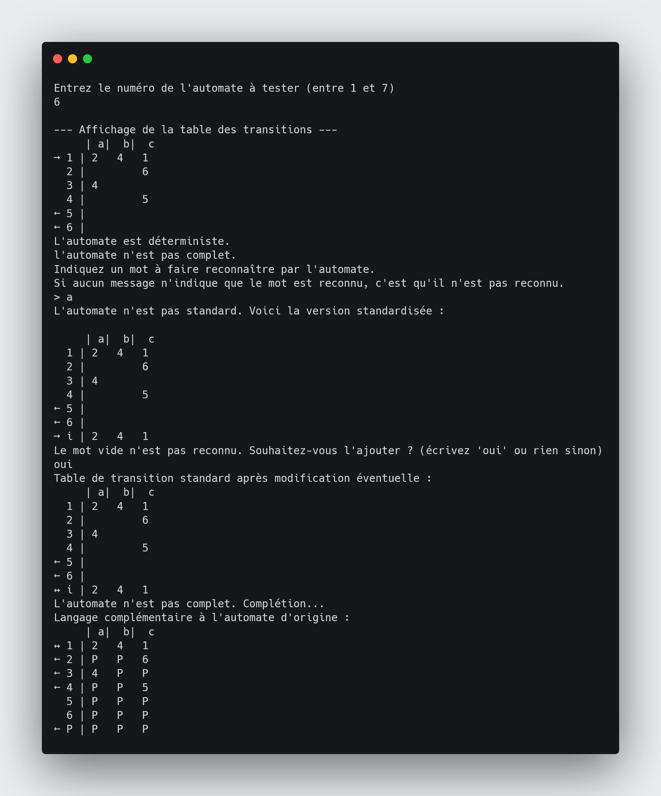

# Python automate

## Vue d'ensemble

Programme en Python réalisé dans le cadre du cours de Maths pour Informatique Automate en L3 au cycle Ingénieur d'Efrei en apprentissage.



Projet réalisé par les étudiants du groupe LS1 (Parcours Logiciels et Systèmes d'information) :

Laurie BRAL \
Mélanie Dang \
CHEN Xing \
Antoine DESPRÉS

Le 15/11/2021

## Usage

1. Exécuter le fichier `src/main.py` soit avec un IDE (Pycharm par exemple) soit dans le terminal avec la commande suivante :

```bash
// Se placer dans src/
cd src
python3 main.py
```

2. Saisir un numéro de la grammaire de 1 à 7 :

```
Entrez le numéro de l'automate à tester (entre 1 et 7) :
```

3. Enjoy !

## Fonctionnalités

Le programme doit mettre en oeuvre les fonctions suivantes :

- lecture d’un automate décrit dans un fichier “.txt” et représentation en mémoire

- affichage de l’automate sous forme d’une table des transitions, en indiquant les états
  initiaux et terminaux

- vérification des propriétés “déterministe” ou non, “complet” ou non de l’automate

- reconnaissance de mots

- standardisation et ajout / élimination du mot vide

- passage au langage complémentaire

La reconnaissance de mots doit être mise en œuvre sur un AF quelconque (déterministe ou
non, complet ou non). Vous pouvez mettre en œuvre plusieurs fonctions (pour automate
déterministe et complet, déterministe mais non complet, non déterministe).

Les traitements de standardisation et de passage au langage complémentaire sont
indépendants l’un de l’autre (le passage au complémentaire se fait sur l’automate lu à
l’étape 1).

Le passage au langage complémentaire doit pouvoir fonctionner sur un automate non
complet (votre programme doit bien entendu le compléter).

## Structure de fichiers

Les traces d'exécution et les automates de test se trouvent dans `docs/`.

## Automates de test

7 automates sont utilisés pour tester le programme. Ils ont les caractéristiques suivantes :

Caractéristiques communes pour tous les automates choisis :

```
alphabet = { a , b , c }
nombre d’états : au moins 5
```

Caractéristiques particulières de chaque automate de 1 à 7 :


